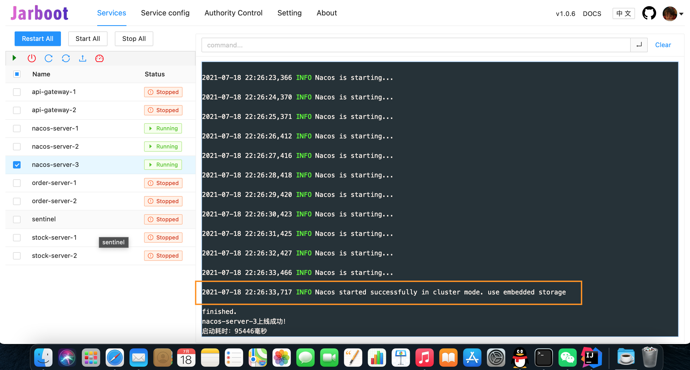
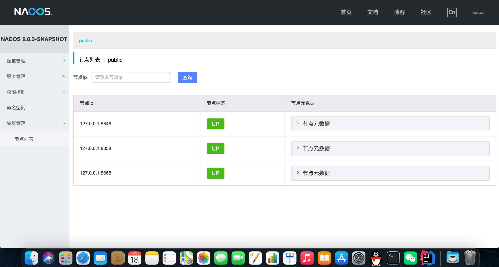
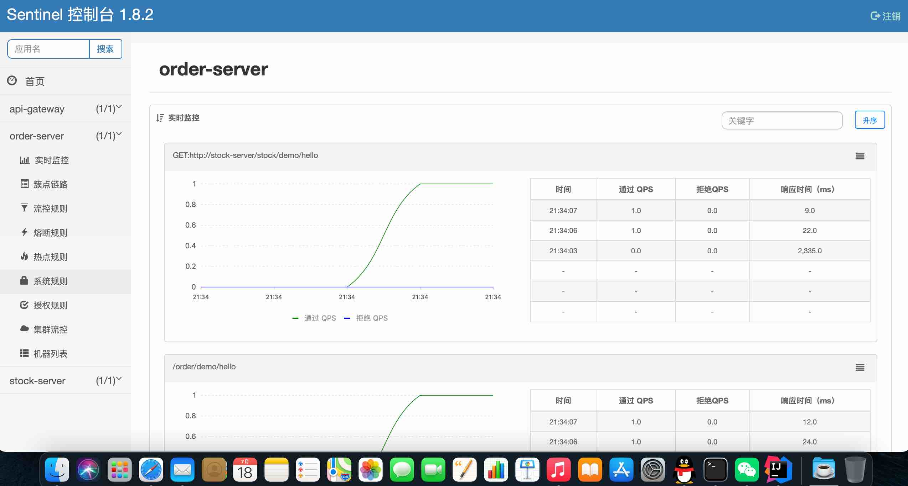

# 使用Jarboot管理Spring Cloud Alibaba系列服务的示例。
en: Use jarboot to manager spring cloud alibaba servers example

[](https://github.com/majianzheng/jarboot-with-spring-cloud-alibaba-example/actions/workflows/codeql-analysis.yml)


## 简介（Brief introduction）
<code>Jarboot</code> 是一个Java进程启动器，可以管理、监控及诊断一系列的Java进程。
(en: Jarboot is a Java process starter，which can manage, monitor and debug a series of Java instance.)
- <code>jarboot</code>: https://github.com/majianzheng/jarboot
- 文档（Docs）：https://www.yuque.com/jarboot/usage/tmpomo

该项目是一种典型使用场景的示例（仅作为学习交流使用），演示当前典型的分布式微服务系统如何使用Jarboot管理、启动。以<code>Spring Cloud Alibaba</code>系列为例，包括<code>Nacos</code>、<code>Alibaba Sentinel</code>
<code>Spring cloud Gateway</code>等。（en: This project is an example of a typical use scenario, demonstrating how the current typical
 distributed micro-service system uses jarboot to manage and start. Take the spring cloud Alibaba series as an example, including Nacos and Alibaba sentinel
Spring cloud gateway, etc.）

## 架构（Architecture）
该项目代码部分包括API网关、示例服务提供者：订单服务和库存服务，演示从API网关进入系统后等调用链路。真实场景下往上还有Tengine、Nginx等
，再往上还有LVS、DNS等，可下载项目后自行集成测试。（en: The code part of the project includes API gateway, sample service provider:
order service and inventory service, and demonstrates the calling link after entering the system from API gateway. 
In real scenes, Tengine, nginx and so on are also on the top
And then there are LVS, DNS, etc. you can download the project and test it by yourself.）
```
⭐ 简略调用流程（Brief call process） ✨
   http客户端   ——▶     网关服务集群    ——▶    订单服务集群    ——▶    库存服务集群
╭─────────────╮       ╭─────────────╮       ╭──────────────╮       ╭──────────────╮
│ Http Client │——————>│ API Gateway │——————>│ Order server │——————>│ Stock server │
╰─────────────╯       ╰─────────────╯       ╰──────────────╯       ╰──────────────╯

🍎 整体架构（Overall Architecture） ✨
                       ┏━━━━━━━━━━━━━━━━━┓ 真实场景下这里有可能是Tengine、Nginx、HAProxy等一种或几种（en: In real 
                       ┃   http proxy    ┃ scene this will be Tengine or Nginx, HAProxy, etc.）
                       ┗━━━━━━━━━━━━━━━━━┛
                                │ http
                                ▼       网关服务集群
            ┏━━━━━━━━━━━━━━━━━━━━━━━━━━━━━━━━━━━━━━━━┓
            ┃ ╭───────────────╮    ╭───────────────╮ ┃─────────────╮
            ┃ │ api-gateway-2 │    │ api-gateway-2 │ ┃             │
            ┃ ╰───────────────╯    ╰───────────────╯ ┃             │
            ┗━━━━━━━━━━━━━━━━━━━━━━━━━━━━━━━━━━━━━━━━┛             ▼
                                                            ┏━━━━━━━━━━━━━━━━━━━┓
           ╭────────────────────────────────────────────────┃   Load balancing  ┃
           │                                                ┗━━━━━━━━━━━━━━━━━━━┛
           │                                                          ▲
           │                                                          │
           │                                                          ▼ 注册中心&配置中心Nacos集群
           │                                                        ┏━━━━━━━━━━━━━━━━━━━━━━━━┓
           │ http                 Load balancing                    ┃     Nacos Cluster      ┃
           │                   ╭─────────────────╮                  ┃  ╭──────────────────╮  ┃
           │                   │  Http RPC call  │                  ┃  │  nacos-server-1  │  ┃
           │                   │                 │                  ┃  ╰──────────────────╯  ┃
           ▼                   │                 ▼                  ┃  ╭──────────────────╮  ┃
┏━━━━━━━━━━━━━━━━━━━━┓         │        ┏━━━━━━━━━━━━━━━━━━━━┓      ┃  │  nacos-server-2  │  ┃
┃Order Server Cluster┃         │        ┃Stock Server Cluster┃      ┃  ╰──────────────────╯  ┃
┃  ╭──────────────╮  ┃         │        ┃  ╭──────────────╮  ┃      ┃  ╭──────────────────╮  ┃
┃  │order-server-1│  ┃         │        ┃  │stock-server-1│  ┃      ┃  │  nacos-server-3  │  ┃
┃  ╰──────────────╯  ┃─────────╯        ┃  └──────────────╯  ┃      ┃  ╰──────────────────╯  ┃
┃  ╭──────────────╮  ┃                  ┃  ╭──────────────╮  ┃      ┗━━━━━━━━━━━━━━━━━━━━━━━━┛
┃  │order-server-2│  ┃                  ┃  │stock-server-2│  ┃                  ▲
┃  ╰──────────────╯  ┃                  ┃  ╰──────────────╯  ┃                  │
┗━━━━━━━━━━━━━━━━━━━━┛                  ┗━━━━━━━━━━━━━━━━━━━━┛                  │
          ▲                                       ▲                  ╭──────────╯ 
          │                                       │                  │    
          ▼                                       ▼                  ▼ 
  ┏━━━━━━━━━━━━━━━━━━━━━━━━━━━━━━━━━━━━━━━━━━━━━━━━━━━━━━━━━━━━━━━━━━━━━━━━━━━━┓ 
  ┃                               Basic Components                             ┃       
  ┃ ╭──────────────────╮  ╭──────────────╮  ╭──────────────╮  ╭──────────────╮ ┃
  ┃ │ Alibaba Sentinel │  │   openfeign  │  │ loadbalancer │  │ Nacos client │ ┃ 
  ┃ ╰──────────────────╯  ╰──────────────╯  ╰──────────────╯  ╰──────────────╯ ┃
  ┗━━━━━━━━━━━━━━━━━━━━━━━━━━━━━━━━━━━━━━━━━━━━━━━━━━━━━━━━━━━━━━━━━━━━━━━━━━━━┛

```
## 快速上手（Quick start）
开始前环境准备(en: Environmental preparation before starting)：
- 首先确保电脑至少安装了jdk8或以上版本；(en: First, make sure that the computer has at least jdk8 or above installed)
- Maven是否已经安装，也可使用IDEA开发工具内置的；(en: Make sure maven is installed, or you can use IDEA's)
- 建议电脑内存高于8G，不然真有压力（Nacos真的很占用内存 😂 ）；(en: It is recommended that the computer memory should be higher than 8G, otherwise it will be really stressful)
### 步骤1（Step 1）：下载项目（Download project）
首先，建议先点个星星 ⭐️ ，<code>fork</code>到自己的仓库中 😊 🌟 别忘了<code>jarboot</code>
也点个星星 👉 ✨ 
```shell
# 使用https
$ git clone https://github.com/majianzheng/jarboot-with-spring-cloud-alibaba-example.git

# 使用ssh
$ git clone git@github.com:majianzheng/jarboot-with-spring-cloud-alibaba-example.git
```
如果没有安装git，可以下载压缩包，<code>Code</code>/<code>Download ZIP</code>
### 步骤2（Step 2）：编译（Compile）
使用Maven编译项目（Use maven to compile）
```shell
$ mvn clean package
```
### 步骤3（Step 3）：下载 & 启动（Download & Startup）
完整的<code>jarboot</code>运行环境在<code>dist</code>目录下。（en: The full execution environment are included in the dist folder.）
#### 下载依赖文件
- 下载jarboot，然后将压缩包内的文件放入<code>dist</code>根目录下
- 下载<code>Nacos</code>，将<code>nacos-server.jar</code>放入<code>dist</code>/<code>services</code>/<code>bin</code>下，将<code>nacos-logback.xml</code>放入<code>dist</code>/<code>services</code>/<code>conf</code>下
- 下载<code>Alibaba Sentinel</code>将jar文件重命名为<code>sentinel-dashboard.jar</code>，放入<code>dist</code>/<code>services</code>/<code>bin</code>下
```
dist                                #dist folder
├─conf                              #jarboot config folder
├─jarboot-spy.jar
├─jarboot-agent.jar  
├─jarboot-core.jar                  
├─jarboot-server.jar                #jarboot server
├─startup.sh
├─shutdown.sh
├─startup.cmd
├─shutdown.cmd
└─services                          #Default root directory which managing other jar files (configurable)
   ├─bin
   │  └─nacos-server.jar            #Nacos服务器
   │  └─sentinel-dashboard.jar      #Sentinel管理服务面板
   ├─conf
   │  └─example.vmoptions           #普通服务默认vm参数配置
   │  └─nacos.vmoptions             #Nacos的vm参数配置
   │  └─nacos-logback.xml           #Nacos的日志配置
   │  └─sentinel.vmoptions          #Sentinel的vm参数配置
   ├─api-gateway-1
   │  └─boot.properties             #服务的配置文件
   └─api-gateway-2                  
      └─boot.properties
   ...                              #其他服务目录，以下省略
   ...
```
#### 启动<code>jarboot</code>
```shell
# 启动jarboot服务
$ cd dist
$ sh startup.sh
```
启动成功后进入<code>jarboot</code>服务管理界面，点击<code>一键启动</code>将会按照：

<code>nacos</code>+<code>Sentinel</code> ➡️ <code>stock-server</code> ➡️ <code>order-server</code> ➡️ <code>api-gateway</code>

的顺序，依次启动集群服务。Nacos集群模式启动成功后如下图所示：




### 步骤4（Step 4）：调用测试接口API（Execute test API）
执行如下Http接口，将会经过<code>api-gateway</code> ➡️ <code>order-server</code> ➡️ <code>stock-server</code>
的调用流程。
```shell
$ curl http://localhost:9901/api/order/demo/hello
```
打开<code>Alibaba Sentinel</code>的管理界面，可看到调用的过程，如下图：



## 配置解读（Setting unscramble）
接下来对重要对配置文件进行解读。（en: Next, the important configuration files are interpreted.）
### 服务启动配置文件——boot.properties（Service starter setting file）
<code>boot.properties</code>文件一个服务对启动配置文件，配置定义了使用哪个jar文件启动、vm options、传入参数、指定对工作路径、指定对jdk、指定的环境变量等信息。

Nacos等启动配置文件如<code>nacos-server-1</code>/<code>boot.properties</code>
```properties
#Properties file Jarboot created.
#Sat Jul 17 18:43:23 CST 2021
daemon=true
# 这里三个nacos服务共用一个vm配置文件，支持绝对和相对路径
vm=../conf/nacos.vmoptions
jarUpdateWatch=true
# nacos服务等启动jar文件，支持绝对和相对路径，此处使用相对路径共用一个
jar=../bin/nacos-server.jar
jdkPath=
env=
#传入参数，3个nacos服务使用--server.port指定端口号
args=--nacos.inetutils.ip-address\=127.0.0.1 --server.port\=8848 --spring.config.additional-location\=./conf --logging.config\=../conf/nacos-logback.xml 
workDirectory=
#启动优先级，指定10为目前最高等，优先启动
priority=10
```
这里使用<code>--server.port=8848</code>指定启动的端口号，3个nacos服务依次为8848、8858、8868。

### vm options配置文件（vm options setting file）
上述<code>boot.properties</code>文件中可以指定一个vm options的配置文件，此文件默认是服务的目录下的<code>boot.vmoptions</code>文件。

也可以自定义位置，可以是绝对路径，也可以是相对于服务目录的相对路径。

Nacos的vm options配置文件<code>nacos.vmoptions</code>如下：
```
-Dloader.path=../plugins/health,../plugins/cmdb
-Dnacos.home=./
-Dnacos.member.list=127.0.0.1:8848,127.0.0.1:8858,127.0.0.1:8868
-DembeddedStorage=true
-server
-Xms512m
-Xmx512m
-Xmn128m
-XX:MetaspaceSize=128m
-XX:MaxMetaspaceSize=128m
-XX:-OmitStackTraceInFastThrow
-XX:+HeapDumpOnOutOfMemoryError
-XX:HeapDumpPath=./java_heapdump.hprof
```
其中内存部分可以根据自身的实力调整，自己的电脑内存小特意调小了些。这里使用vm参数指定了<code>Nacos集群</code>的节点列表：

<code>-Dnacos.member.list=127.0.0.1:8848,127.0.0.1:8858,127.0.0.1:8868</code>

使用<code>-Dnacos.home=./</code>指定工作路径文件当前路径，即为对应的服务目录。

<code>stock-server</code>、<code>order-server</code>和<code>api-gateway</code>共用一个vm配置文件：<code>example.vmoptions</code>
```
-Dsentinel.host=127.0.0.1:10000
-Xms128m
-Xmx128m
-XX:-OmitStackTraceInFastThrow
-XX:+HeapDumpOnOutOfMemoryError
-XX:HeapDumpPath=./java_heapdump.hprof
```
这里使用<code>-Dsentinel.host=127.0.0.1:10000</code>指定<code>sentinel</code>的地址和端口。
这个几个服务只是示例，没有业务逻辑，因此分配了较少的内存。
