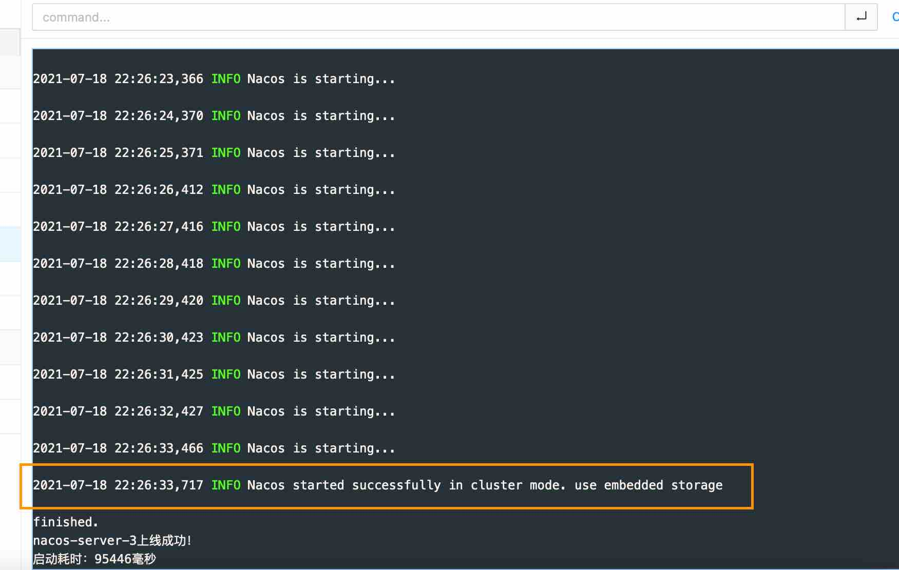

# 使用Jarboot管理spring cloud alibaba系列服务的示例。
en: Use jarboot to manager spring cloud alibaba servers example

[](https://github.com/majianzheng/jarboot-with-spring-cloud-alibaba-example/actions/workflows/codeql-analysis.yml)


## 简介（brief introduction）
<code>Jarboot</code> 是一个Java进程启动器，可以管理、监控及诊断一系列的Java进程。
(en: Jarboot is a Java process starter，which can manage, monitor and debug a series of Java instance.)
- <code>jarboot</code>: https://github.com/majianzheng/jarboot
- 文档（Docs）：https://www.yuque.com/jarboot/usage/tmpomo

该项目是一种典型使用场景的示例，演示当前典型的分布式微服务系统如何使用Jarboot管理、启动。以<code>Spring Cloud Alibaba</code>系列为例，包括<code>Nacos</code>、<code>Alibaba Sentinel</code>
<code>Spring cloud Gateway</code>等。（en: This project is an example of a typical use scenario, demonstrating how the current typical
 distributed micro-service system uses jarboot to manage and start. Take the spring cloud Alibaba series as an example, including Nacos and Alibaba sentinel
Spring cloud gateway, etc.）

## 架构（Architecture）
该项目代码部分包括API网关、示例服务提供者：订单服务和库存服务，演示从API网关进入系统后等调用链路。真实场景下往上还有Tengine、Nginx等
，再往上还有LVS、DNS等，可下载项目后自行集成测试。（en: The code part of the project includes API gateway, sample service provider:
order service and inventory service, and demonstrates the calling link after entering the system from API gateway. 
In real scenes, Tengine, nginx and so on are also on the top
And then there are LVS, DNS, etc. you can download the project and test it by yourself.）
```
⭐ 简略调用流程（Brief call process） ✨
   http客户端     ——▶     网关服务集群    ——▶      订单服务集群     ——▶    库存服务集群
┌─────────────┐       ┌─────────────┐       ┌──────────────┐       ┌──────────────┐
│ Http Client │——————▶│ API Gateway │——————▶│ Order server │——————▶│ Stock server │
└─────────────┘       └─────────────┘       └──────────────┘       └──────────────┘

🍎 整体架构（Overall Architecture） ✨
                       ┏━━━━━━━━━━━━━━━━━┓ 真实场景下这里有可能是Tengine、Nginx、HAProxy等一种或几种（en: In real scene this will
                       ┃   http client   ┃ be Tengine or Nginx, HAProxy, etc.）
                       ┗━━━━━━━━━━━━━━━━━┛
                                │ http
                 ╭——————————————┴——————————————╮
                 ▼                             ▼ 
      ┏━━━━━━━━━━━━━━━━━┓              ┏━━━━━━━━━━━━━━━━━┓
      ┃  api-gateway-1  ┃              ┃  api-gateway-2  ┃ 网关服务集群
      ┗━━━━━━━━━━━━━━━━━┛              ┗━━━━━━━━━━━━━━━━━┛
               │                                │
               │                                │
               ╰————————————————┬———————————————╯
                                │ 负载均衡                                     注册中心&配置中心Nacos集群
                                ▼                                           ┏━━━━━━━━━━━━━━━━━━━━━━━━┓
            http      ┏━━━━━━━━━━━━━━━━━━━┓                                 ┃     Nacos Cluster      ┃
          ╭———————————┃   Load balancing  ┃◀———————————————————————————————▶┃  ┌──────────────────┐  ┃
          │           ┗━━━━━━━━━━━━━━━━━━━┛                                 ┃  │  nacos-server-1  │  ┃
          │                                                                 ┃  └──────────────────┘  ┃
          ▼                                                                 ┃  ┌──────────────────┐  ┃
┏━━━━━━━━━━━━━━━━━━━━┓                  ┏━━━━━━━━━━━━━━━━━━━━┓              ┃  │  nacos-server-2  │  ┃
┃Order Server Cluster┃                  ┃Stock Server Cluster┃              ┃  └──────────────────┘  ┃
┃  ┌──────────────┐  ┃                  ┃  ┌──────────────┐  ┃              ┃  ┌──────────────────┐  ┃
┃  │order-server-1│  ┃  Load balancing  ┃  │stock-server-1│  ┃              ┃  │  nacos-server-3  │  ┃
┃  └──────────────┘  ┃—————————————————▶┃  └──────────────┘  ┃              ┃  └──────────────────┘  ┃
┃  ┌──────────────┐  ┃  Http RPC call   ┃  ┌──────────────┐  ┃              ┗━━━━━━━━━━━━━━━━━━━━━━━━┛
┃  │order-server-2│  ┃                  ┃  │stock-server-2│  ┃                          ▲
┃  └──────────────┘  ┃                  ┃  └──────────────┘  ┃                          │
┗━━━━━━━━━━━━━━━━━━━━┛                  ┗━━━━━━━━━━━━━━━━━━━━┛                          │
          ▲                                       ▲                                     │ 
          │                                       │                                     │
          ▼                                       ▼                                     │
  ┏━━━━━━━━━━━━━━━━━━━━━━━━━━━━━━━━━━━━━━━━━━━━━━━━━━━━━━━━━━━━━━━━━━━┓                 │
  ┃                        Basic Components                           ┃                 │
  ┃ ┌──────────┐  ┌──────────────┐  ┌──────────────┐ ┌──────────────┐ ┃◀————————————————╯
  ┃ │ Sentinel │  │   openfeign  │  │ loadbalancer │ │ Nacos client │ ┃ 
  ┃ └──────────┘  └──────────────┘  └──────────────┘ └──────────────┘ ┃
  ┗━━━━━━━━━━━━━━━━━━━━━━━━━━━━━━━━━━━━━━━━━━━━━━━━━━━━━━━━━━━━━━━━━━━┛

```
## 快速上手（Quick start）
开始前环境准备(en: Environmental preparation before starting)：
- 首先确保电脑至少安装了jdk8或以上版本；(en: First, make sure that the computer has at least jdk8 or above installed)
- Maven是否已经安装，也可使用IDEA开发工具内置的；(en: Make sure maven is installed, or you can use IDEA's)
- 建议电脑内存高于8G，不然真有压力（Nacos真的很占用内存 😂 ）；(en: It is recommended that the computer memory should be higher than 4G, otherwise it will be really stressful)
### 步骤1（Step 1）：下载项目（Download project）
首先，建议先点个星星 ⭐️ ，<code>fork</code>到自己的仓库中 😊 🌟 别忘了<code>jarboot</code>

也点个星星 👉 ✨ 
```shell
# 使用https
$ git clone https://github.com/majianzheng/jarboot-with-spring-cloud-alibaba-example.git

# 使用ssh
$ git clone git@github.com:majianzheng/jarboot-with-spring-cloud-alibaba-example.git
```
如果没有安装git，可以下载压缩包，<code>Code</code>/<code>Download ZIP</code>
### 步骤2（Step 2）：编译（Compile）
使用Maven编译项目（Use maven to compile）
```shell
$ mvn clean package
```
### 步骤3（Step 3）：启动（Startup）
完整的<code>jarboot</code>运行环境在<code>dist</code>目录下。（en: The full execution environment are included in the dist folder.）
```shell
# 启动jarboot服务
$ cd dist
$ sh startup.sh
```
启动成功后进入<code>jarboot</code>服务管理界面，点击<code>一键启动</code>将会按照：

<code>nacos</code>+<code>Sentinel</code> ➡️ <code>stock-server</code> ➡️ <code>order-server</code> ➡️ <code>api-gateway</code>

的顺序，依次启动集群服务。Nacos集群模式启动成功后如下图所示：




### 步骤4（Step 4）：调用测试接口API（Execute test API）
执行如下Http接口，将会经过<code>api-gateway</code> ➡️ <code>order-server</code> ➡️ <code>stock-server</code>
的调用流程。
```shell
$ curl http://localhost:9901/api/order/demo/hello
```
打开<code>Sentinel</code>的管理界面，可看到调用的过程，如下图：


